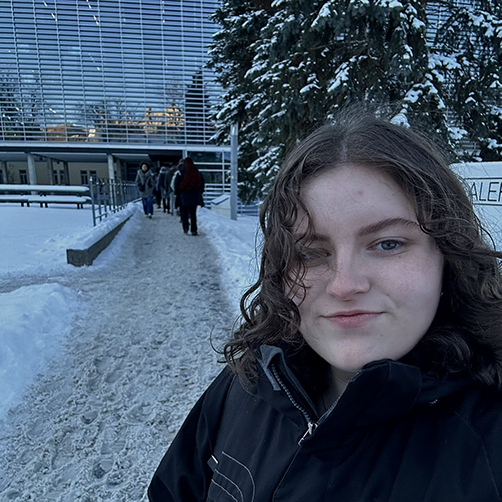
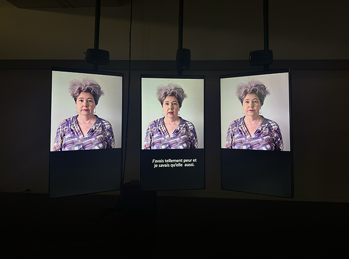
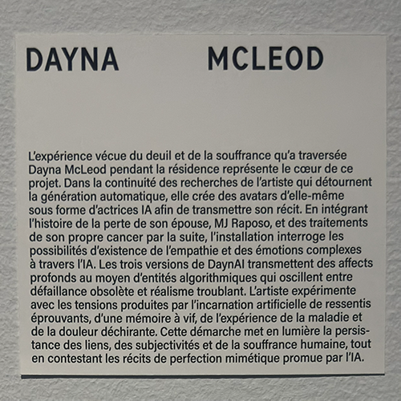
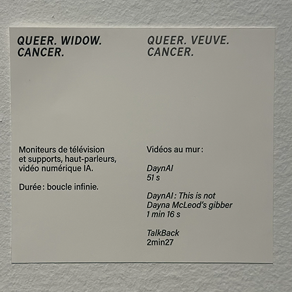
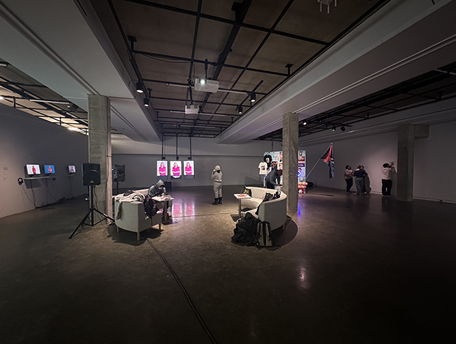
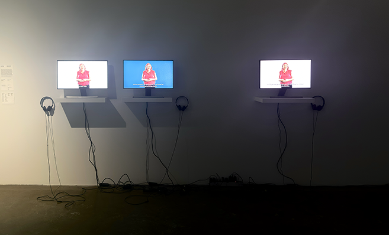
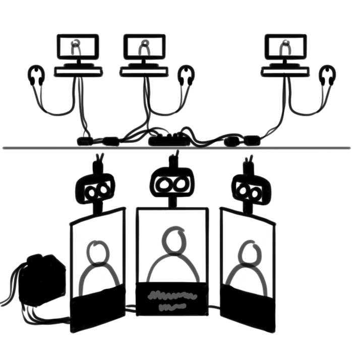
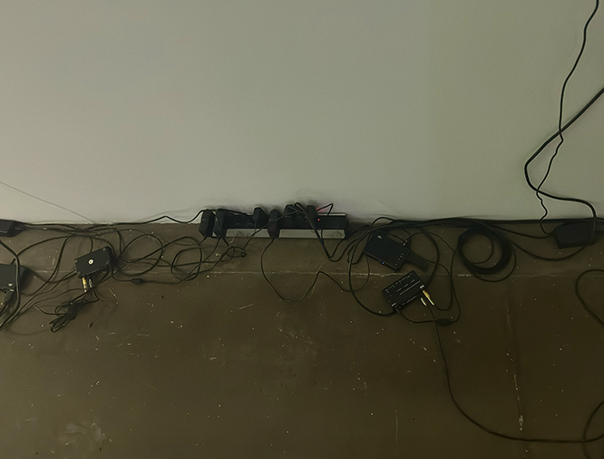
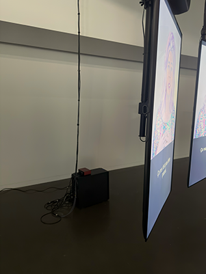
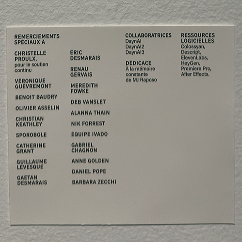

# Documentation de l'oeuvre: Queer. Veuve. Cancer.
 

> Affiche de l'exposition **Devenirs partagés - Pratiques de l'IA**, installée à la galerie de l'université de Montréal.

 

## Introduction
Le jeudi 29 janvier 2026, j'ai visité l'exposition temporaire ***Devenirs partagés - Pratiques de l'IA***. Cette exposition intérieure est exposé à la galerie de l'université de Montréal du 28 novembre 2025 au 28 février 2026. J'y ai découvert 4 oeuvres distincte dont ***Queer. Veuve. Cancer.*** par ***Dayna MCleod***. 

> Moi devant l'entrée de la galerie de l'université de Montréal.

 

 
## Queer. Veuve. Cancer.

 
> Principaux écrans de l'installation de l'oeuvre *Queer. Veuve. Cancer.*.
 

***Queer. Veuve. Cancer.*** est une oeuvre créé par l'artiste de performance et vidéaste montréalaise ***Dayna MCleod***, aussi connue sous le nom ***Daynarama***. Cette installation multimédia a officiellement vue le jour le 10 janvier 2026 à la galerie. Dans cette oeuvre, Dayna exprime son ressenti face à la perte de sa femme MJ suite à un cancer du pancréas, et parle de son propre diagnostic d'un cancer du colon. Son histoire est partagé au monde par 3 sosies d'elle créé par l'intelligence artificielle. Ces 3 Dayna (Dayna1, Dayna2 et Dayna3) vont documenter son deuil, sa chimiothérapie et l'importance de la comunauté Queer dans les dures épreuves qu'elle a traversée à l'oral, tout en ayant une gestuelle très semblable à l'humain. Ces sosie font ressentir toutes sortes d'émotions au spectateur.
  
Comme dit Dayna dans la description de son oeuvre sur son site web : ***"can we experience empathy through AI?"***

 
> Cartel de l'oeuvre *Queer. Veuve. Cancer.* explicant celle-ci.
 

Pour plus d'informations, la vidéo explicative ***Talkback*** fait partie du projet et est disponnible ci-joint :
<https://vimeo.com/1136945289?fl=pl&fe=sh>

Voici le lien vers la page de présentation de l'installation ***Queer. Veuve. Cancer.*** :
<https://daynarama.com/queer-widow-cancer/>

Pour plus d'informations sur l'artiste, voici sa Bio sur son site web :
<https://daynarama.com/bio/>

 

## Mise en exposition de l'oeuvre

 
> Vue d'ensemble de la salle d'exposition à la galerie de l'Université de Montréal.

 
> Postes avec vidéos complémentaires à la vidéo principale du projet.

> Principaux écrans de l'installation de l'oeuvre *Queer. Veuve. Cancer.*

 

L'installation de cette oeuvre est à la fois à but comtemplatif et à but immersif. Même si on ne se retrouve pas dans une pièce qui stimule nos sens, les écrans en angle de l'installation principale créent une bulle autour du spectateur et l'enveloppe dans l'hisoire que partage ***Dayna2***, la deuxième sosie de Dayna. Cette installation met en valeur l'histoire de Dayna pour que l'on apprenne à la connaître à travers les multiples vidéos disponnibles à écouter et regarder.

 
>Croquis de l'installation fait suite à la visite de l'exposition.

 

## Mise en espace

 
>Fils permettant la connection des moniteurs au mur.

 
>Ordinateur à l'arrière des écrans.

L'oeuvre de Dayna se trouve au fond à gauche de l'entrée de la salle d'exposition de la galerie. L'oeuvre se divise en deux parties: Les écrans principaux et les postes avec les moniteurs. Lorsque l'on regarde les écrans principaux, sur le mur adjacent de gauche se retrouve les moniteurs d'environ 15 pouces sur de petites tables avec des casques d'écoute pour écouter les diverses vidéo présentées. Les moniteurs et le cartel prennent quatre à cinq mètres sur le long du mur avec le matériel au dessous. Du côté des écrans principaux d'environ 50 pouces, au dessus de chaque écrans se retrouve un haut parleur. Les haut-parleur et écrans entourant celle du milieux sont en angles d'environ 35 à 45 degré vers celle-ci. Un espace d'environ 3 mêtres carrés est disponnible pour se déplacer devant les écrans et un espace semblable est à l'arrière des écrans, où se retrouve l'ordinateur et du matériel. Les 3 écrans sont soutenue par le plafond par des barres de métaliques, elles ne touche donc pas le sol et ne sont pas installées sur un mur.

 

## Composants et techniques
Les composantes techniques sont majoritairement composés de fil ainsi que de multiples écrans.   

Sur le mur des moniteurs nous pouvons y retrouver:
- 3 moniteurs d'environ 15 pouces
- 3 casques découte filaire
- 3 préamplis pour contrôler le son des vidéos
- Une multiprise pour brancher les écrans et les préamplis
  
 

Du côté des écrans nous pouvons y retrouver:
- 3 écrans d'environ 50 pouces
- 3 haut-parleurs
- l'ordinateur qui contrôle l'oeuvre et qui joue les vidéos en boucle
- un préampli pour contrôler le son des haut-parleurs
- des fils reliant l'installation côté moniteur à l'ordinateur

  

Les éléments comme les écrans et l'ordinateur sont plus lourds, fragile et donc plus compliqué à voyager d'une destination à l'autre.

  

## Éléments nécessaires à la mise en exposition
Le musée a mis en places quelques dispositifs pour la mise en place de cette oeuvre: 
- Des câbles ent tout genre
- Les tablettes servant à créer les 3 stations avec moniteurs
- Les barres qui soutienent les matériel à partir du plafond
- des attaches fils pour que ceux-ci soient bien attachés sur les barres qui soutiennent le matériel
  
  

Il est possible que d'autres éléments ont étés fournis par la galerie.

 

## Expérience vécue

 
> Vue d'ensemble de la salle d'exposition à la galerie de l'Université de Montréal.

### Posture du visiteur
L'orsque l'on rentre dans la salle d'exposition, il est posible de se diriger vers l'oeuvre que l'on souhaite. Il n'y a pas d'ordre précis ni chemin à suivre. La salle est légèrement obsurcie, les oeuvres elles sont bien éclairées. Au milieu de la salle se retrouve des fauteuils où l'on peut s'asseoir. Nous pouvons donc se diriger vers l'oeuvre librement puis, rendu à l'oeuvre, il est possible d'écouter les 3 vidéos expliquant le processus de création sur les moniteurs à l'aide des casques découte, ou bien de se diriger devant les écrans principaux pour écouter l'histoire que raconte Dayna2. Il n'y a aucune interaction à faire avec les vidéos à part mettre un casque aux moniteurs, les vidéos jouent en boucle.

 

### Mon opinion sur cette oeuvre
Personnelement, j'ai ressentie plusieurs choses en rentrant dans cette expérience qu'est l'oeuvre de Dayna MCleod. J'ai fait le tour du spectre des émotions, j'ai pu ressentir de la joie comme de la tristesse. Cette expérience nous fait réaliser que si un dispositif composé d'intelligence artificielle partage un comportement humain avec nous, les humains, nous sommes aptes à avoir de l'empathie envers le dispositif comme si il serait lui-même humain.

 

j'ai aimé ce moyen de créer de l'empathie envers quelque chose d'iréel. Peu de personnes sont prêtes à développer une relation affective avec une chose qui n'existe pas réellement, mais cette oeuvre fait totallement ça. Contre notre gré, on construit de l'empathie et des émotions envers l'intelligence artificielle car elle prend la forme d'une personne. L'oeuvre joue dans cette division que nous avons avec l'intelligence artificielle. Ressentir le besoin de soutenir quelque chose d'iréel, la science derrière le cerveau humain est très intéressant!

 

Je crois que l'un des aspects que je ne reproduirait autrement serait les postes avec les moniteurs. J'ai aimé que 3 vidéos explicatives soient à disposition, mais je crois que chacun des moniteurs devraint jouer les 3 vidéos l'une après les autres. Lorsqu'une vidéo est présentée par poste, il est parfois compliqué d'écouter les autres vidéos puisques d'autres personnes occupent déjà les autre postes. Se serait plus fluide de pouvoir écouter les 3 vidéos disponnible bac à bac sans changer d'espace constamment.

 

## Références

J'ai (Florence Emond) pris toutes les images de l'exposition dans cette fiche et j'ai aussi dessiné le croquis.   

J'ai utilisé les sites ci-bas pour ajouter de l'information complémentaire à ma fiche:   

Vidéo Talkback : <https://vimeo.com/1136945289?fl=pl&fe=sh>

Site web de l'artiste Dayna MCleod : <https://daynarama.com>
> J'ai consulté sa biographie et la page de l'installation *Queer. Veuve. Cancer.*

Page de l'exposition *Devenirs partagés: Pratiques de l'IA* sur le site de la galerie de l'université de Montréal : <https://galerie.umontreal.ca/devenirs-partagees-pratiques-de-lia.php>

Troisième partie du cartel:

 
