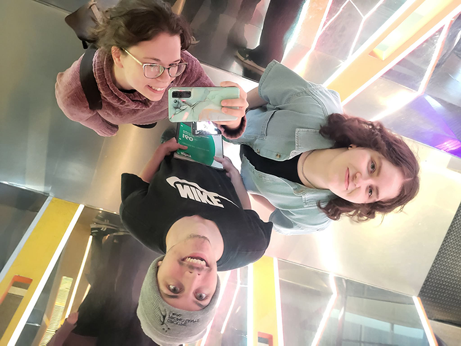
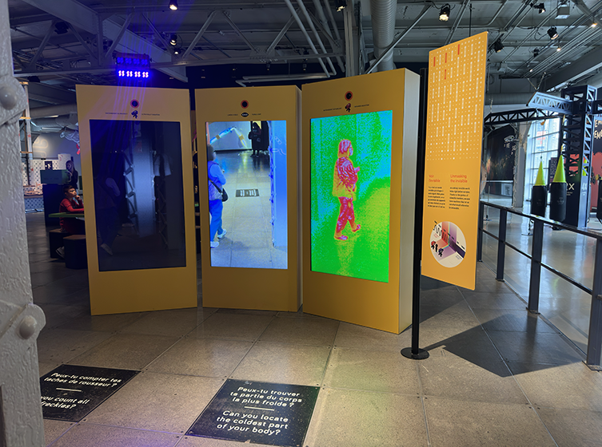
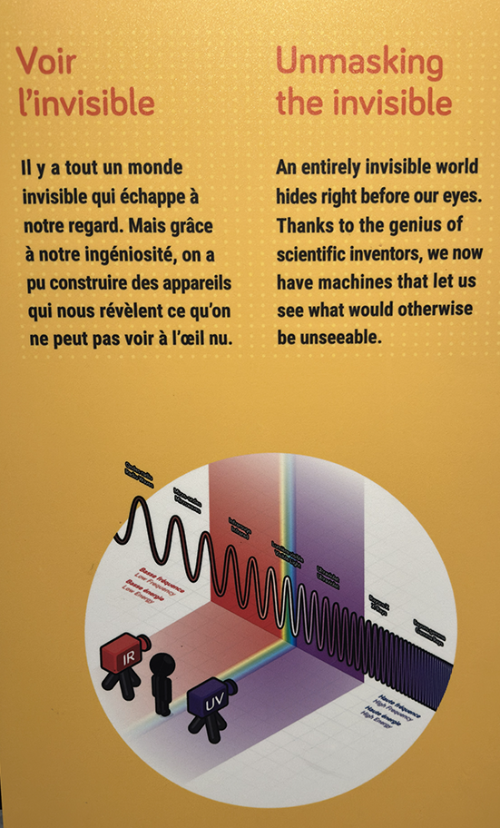
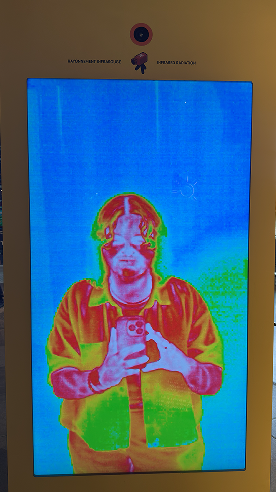
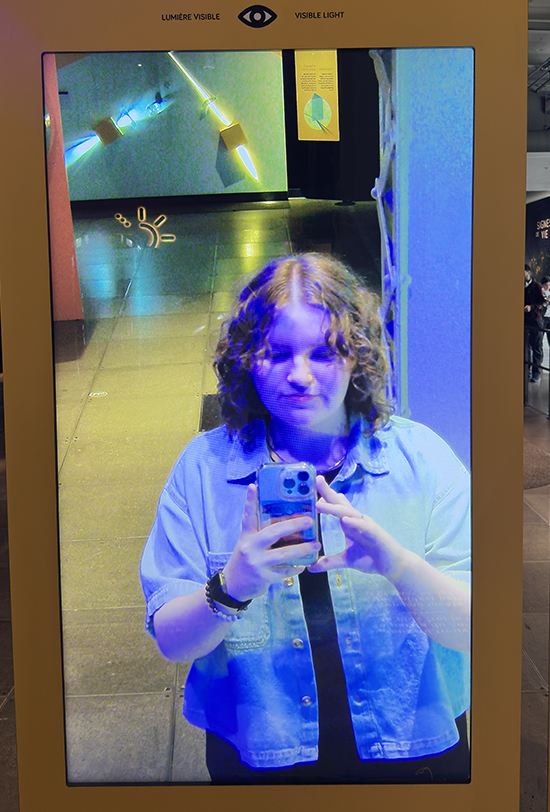
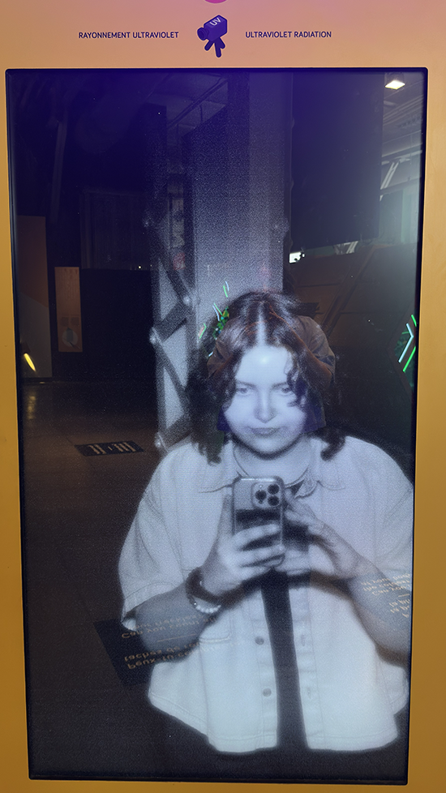
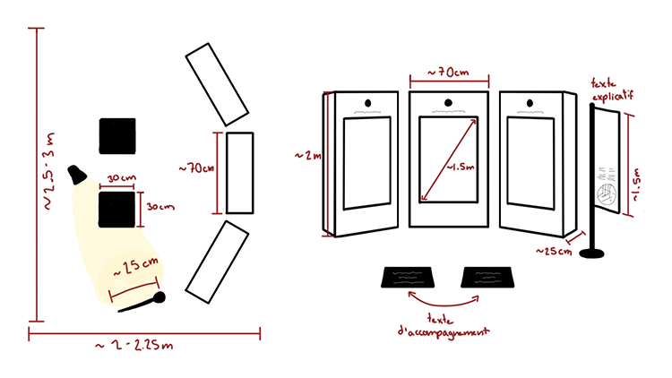
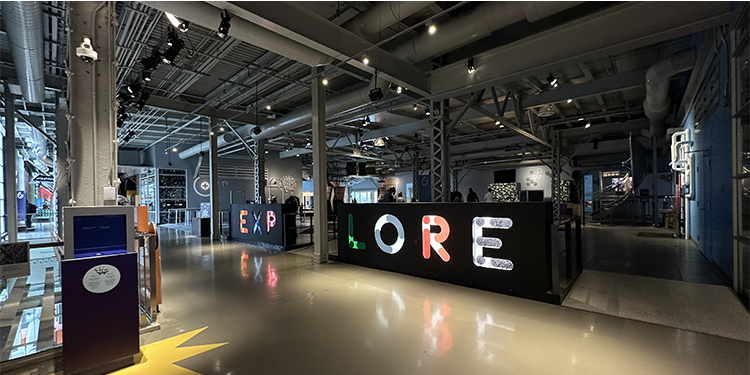
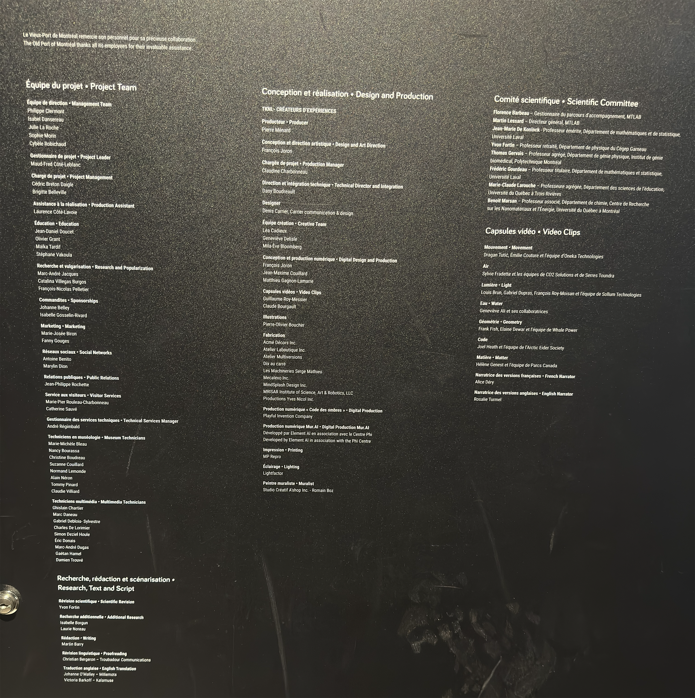

# Documentation du dispositif: Voir l'invisible

> Affiche de l'exposition ***Explore - La science en grand***, installé au Centre des Sciences de Montréal. Image provenant du site web du vieux-port de Montréal.

 

## Introduction
Le jeudi 2 avril 2026, j'ai visité l'exposition permanente ***Explore - La science en grand***. Cette exposition intérieure est exposée au Centre des Sciences de Montréal depuis le 28 novembre 2019. ***Explore - La science en grand*** est une version améliorée de l'Exposition  ***Science 26***, qui existait depuis 2007! Celle-ci a fermé en septembre 2019 pour laisser place à son successeur. Nous pouvons retrouver des dispositifs, multimédia ou non, de tout genre dans cette exposition. Cette fiche va parler plus en détails du dispositif ***Voir l'invisible***.

> Moi dans le kadélioscope de l'entrée de l'Exposition ***Explore - La science en grand*** au Centre des Sciences de Montréal avec Colin Dubé et Kellie Gravel. Photo prise par Kellie Gravel.

 

## Voir l'invisible

> Vue globale du dispositif ***Voir l'invisible***

 

***Voir l'invisible*** est un dispositif créé par les équipes du Centre des Sciences de Montréal ainsi que la firme TKNL expériences. Cette installation permet de découvrir ce que nos yeux ne peuvent pas voir dans la réalité. Comme en dit le titre, il est possible de voir l'invisible grâce à une caméra infrarouge ainsi qu'une caméra ultraviolet en se déplaçant devant celles-ci. Les vidéos enregistrées par les caméras sont diffusées en temps réel sur de grandes écrans pour que petits et grands analysent un autre sens à la réalité.

  

> Texte de présentation du dispositif ***Voir l'invisible***

  

## Mise en exposition

L'installation de ce dispositif est à but contemplatif et à but interactif. Avec ses 3 écrans, il est possible de découvrir à quoi l'on ressemble dans le noir avec la caméra ultraviolet à la gauche, à découvrir les sources de chaleur les plus puissante de notre corps avec la caméra infrarouge à la droite et puis de comparer le tout avec l'aperçu de la caméra régulière au centre. L'expérience générale de ce dispositif est de se promener devant les caméras, d'analyser ce que l'on peut voir aux écrans.

 

## Mise en espace

>Écran avec la caméra infrarouge du dispositif.

>Écran avec la caméra régulière du dispositif.

>Écran avec la caméra ultraviolet du dispositif.

 

***Voir l'invisible*** est l'un des premiers dispositifs que l'on peut apercevoir lorsque l'on rentre dans la section où il y a la majorité des dispositifs multimédias. Les écrans et les caméras sont installés dans des boites en métal et sur chacune d'entre elles est inscrit le type de caméra utilisé. à la droite du dispositif se retrouve le texte de présentation et du texte d'accompagnement est aussi inscrit au sol. Des phrases comme "Peux-tu compter tes taches de rousseur" ou bien "Peux-tu trouver ta partie du corps la plus froide" y sont inscrite pour faciliter l'interaction avec le dispositif pour certains. Une lumière installée sur une poutre au plafond éclaire le texte de présentation. Les autres sources de lumières sont les lumières d'ambiances violettes qui sont à quelques endroit dans l'exposition puis les écrans elles-mêmes. Très peu de matériel et de composants techniques sont visibles dans cette installation, tout est caché dans les boites en métal, mais il est assez simple de se douter que chacunes des caméras sont reliés aux écrans respectives avec un câble hdmi, que les écrans et les caméras ont leurs fil d'alimentation et qu'il y a un certain composant qui permet aux caméras de tourner en continu sur les écrans sans manquer d'espace de stockage vidéo.

 

> Croquis deu dispositif fait suite à la visite de l'exposition.

 

 
## Composants techniques
Voici les composants de l'installation apercevables lors de ma visite:

 

**Composants techniques**
- 3 écrans géants
- 1 caméra avec objectif régulier.
- 1 caméra infrarouge
- 1 caméra ultraviolet
- Composant(s) pour permettre la lecture en direct et en continu des caméras sur les écrans.

**Câbles**
- 3 câbles HDMI
- 3 Câbles d'alimentation pour les écrans
- 3 câbles d'alimentation pour les batteries des caméras
- Tout autre fils pour les composants de lecture

 

La structure de l'installation est plutôt encombrante et ne semble pas se désassembler facilement. Lors d'un possible transport, il serait préférable de bien protéger la structure et les écrans car tout cela semble assez fragile et lourd.

 

## Éléments nécessaires à la mise en exposition
Le Centre des Sciences de Montréal a utilisé ce matériel pour la mise en place de cette oeuvre: 

 

**Texte de présentation**
- Le texte de présentation sur son pied.
- Un point de lumière accroché à une poutre au plafond.

**Sol**
-Autocollant au sol pour le texte d'accompagnement.
  

 

Il est possible que d'autres éléments soient fournis par le Centre des Sciences.

 

## Expérience vécue

> Vue d'ensemble de l'Exposition depuis l'entrée de celle-ci.

 

### Posture du visiteur
L'entrée principale de l'exposition se trouve à la première partie de celle-ci. Un certain ordre chronologique est mis en place puisque l'exposition est divisée en quatre parties. Naturellement, les visiteurs vont découvrir l'exposition de la première à la quatrième partie. Toutefois, il n'est pas défendu de rentrer dans l'exposition par sa sortie à la quatrième partie. Rentrer de ce côté permet de voir l'oeuvre ***Mawlukhotine - Travaillons tous ensemble*** en premier donc il est possible que cette oeuvre soit l'introduction à l'exposition pour certains. 

Si on explore l'exposition dans l'ordre suggéré, la première partie est composé de plusieurs projections murale directement à l'entrée. La deuxième partie est un assemblage de textes, de vidéos, de photographies et d'objets en exposition éparpillés dans une même pièce. La troisième partie est semblabe à la partie précédente, mais intègre aussi de la projection murale et se retrouve dans une pièce à l'atmosphère et à l'éclairage plus sombre. Finalement, la quatrième partie est une conclusion aux autres parties, sous forme de vidéos et d'objets en exposition.

 

### Mon opinion sur l'oeuvre
J'ai apprécié le contenu présenté à travers cette oeuvre. Il est possible, à travers les 14 vidéos, de découvrir 14 projets extrêmement pertinents et bénéfiques à la communauté autochtone et allochtone du Québec. Ne faisant pas partie de ces communautés, je ne suis pas beaucoup sensibilisé aux moyens que prennent les premières nations pour préserver leur patrimoine, éduquer les prochaines génération et mettre en valeur leur droits. Je trouve que cette oeuvre est un parfait moyen de sensibiliser des personnes dans la même situation que moi, puis de mettre sous le feu des projecteurs des organismes et projets valorisants qui ont droit à beaucoup plus de visibilité.

Comme J'ai dit plus haut, j'aime que cette installation peut sensibiliser la population sous différents aspects. Grâce à une oeuvre de ce genre, je suis persuadé qu'au moins une personne s'est demandé: "Comment puis-je aider ma communauté et les communautés qui m'entourent?". J'espère que certaines personnes ont décidé de prendre action et de s'investir dans un OBNL, de faire des dons ou bien de partager avec leur proches les ressources présentées dans cette oeuvre qui mérite d'être mise de l'avant. 

L'un des aspects que j'ai moins aimé dans l'oeuvre est la qualité de production de certaines des vidéos présentées. Certaines vidéos sont sous forme de documentaire, avec des images, des vidéos et de l'audio de bonne qualité, tandis que d'autres sont majoritairement composé de vidéos prises à la webcam avec une qualité sonore beaucoup plus basse. Je trouve que la qualité de certaines vidéos auraient pu être amélioré avec l'utilisation d'un micro de meilleure qualité. Aussi, certaines vidéos ont des coupures de montage qui pourraient être améliorés au niveaux de l'audio. malgré tout, ces points ne gâchent pas l'expérience générale qu'offre l'oeuvre.

 

## Références

J'ai (Florence Emond) photographié toutes les images de l'exposition et dessiné tous les croquis présents dans cette fiche, à moins spécifié autrement dans la légende de l'image. 

 

**J'ai utilisé les ressources ci-jointes pour enrichir ma documentation:** 

 

Page de l'exposition sur le site web du Centre des Sciences de Montréal: <https://www.centredessciencesdemontreal.com/exposition-permanente/explore?_gl=1*e4y926*_gcl_au*NDg1MDQ4ODUuMTc3NTc1NzgwNA..*_ga*MjMyNzAxMjAuMTc3NTc1NzgwNA..*_ga_H22CRNZ3Q1*czE3NzU3NTc4MDQkbzEkZzEkdDE3NzU3NTc5NjUkajU5JGwwJGgw>

Article sur le site du Centre des Sciences de Montréal qui parle de L'exposition Science 26: <https://www.centredessciencesdemontreal.com/blogue/explore-reinventer-un-classique>

Site web de la firme ayant travaillé sur l'exposition: <https://www.tknl.com/projet-experiences/explore-la-science-en-grand-centre-des-sciences-de-montreal>

Page web du site du vieux port de Montréal parlant de l'Ouverture de l'exposition: <https://www.vieuxportdemontreal.com/salle-de-presse/lexposition-interactive-explore-ouvre-ses-portes-le-28-novembre-au-centre-des>

Page web du site INT. DESIGN qui documente rapidement l'Exposition et l'un de ses prix: <https://int.design/fr/projets/explore-la-science-en-grand/>

Article de La Presse qui parle de l'ouverture de l'exposition et de ses attraits: <https://www.lapresse.ca/societe/2019-11-28/explore-une-exposition-permanente-renouvelee>

Crédits de l'exposition: 
