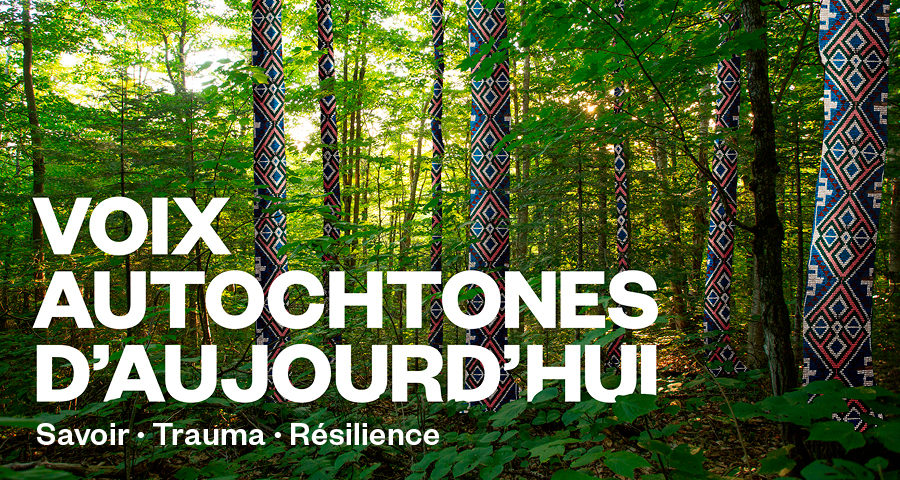
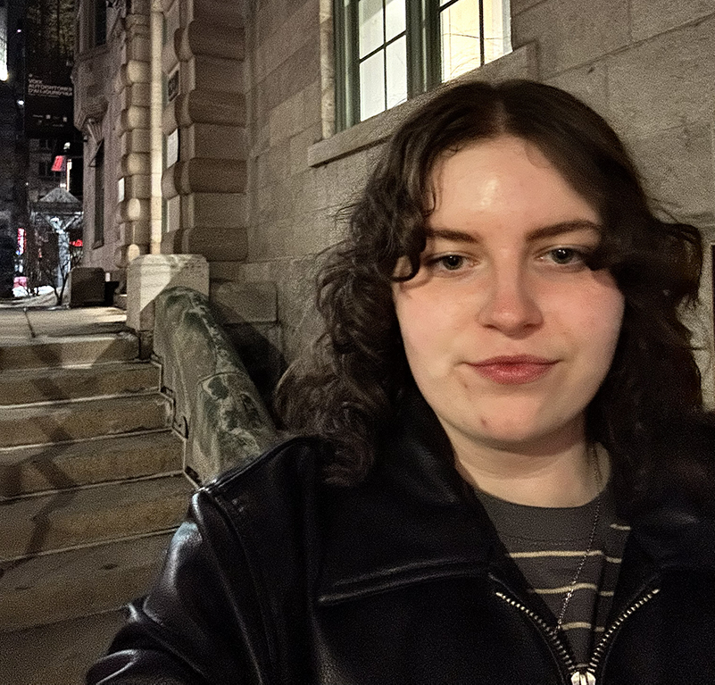
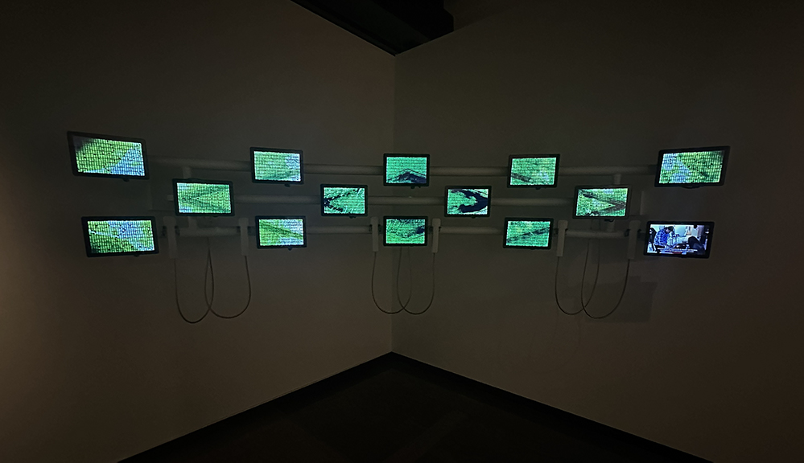
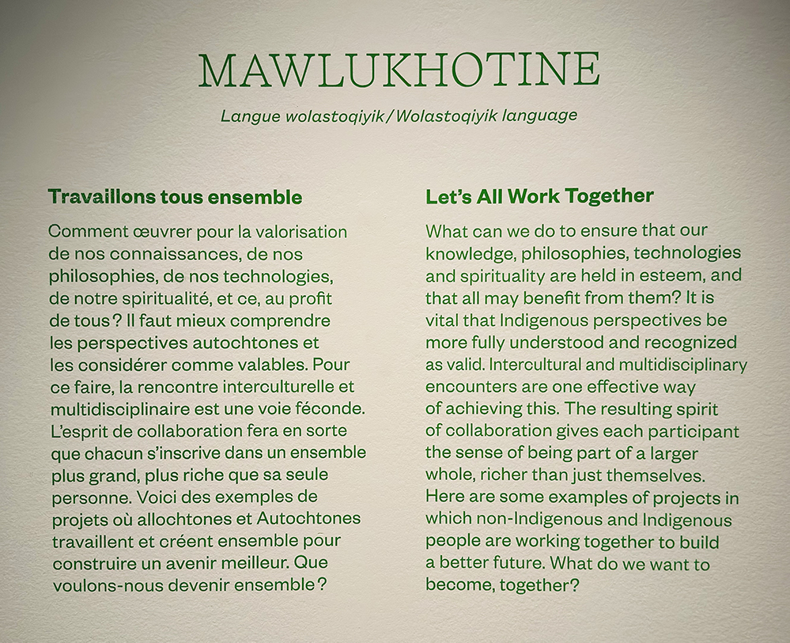
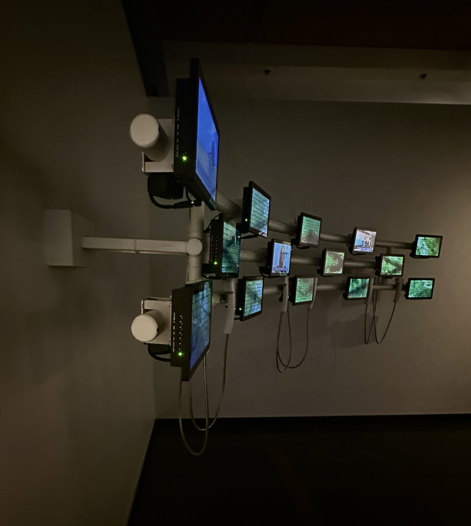
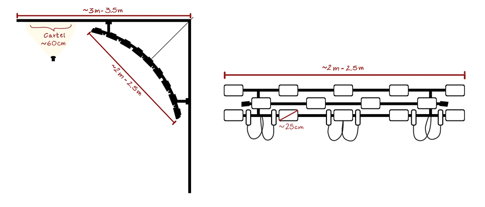
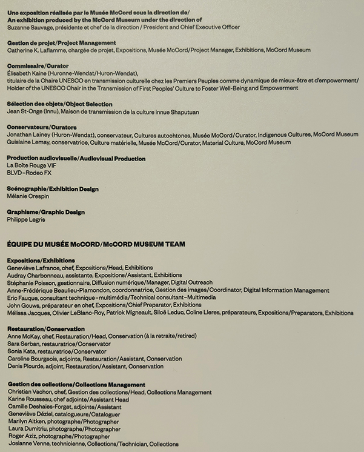

# Documentation de l'oeuvre: Mawlukhotine - Travaillons tous ensemble

> Affiche de l'exposition ***Mawlukhotine - Travaillons tous ensemble***, installé au musée McCord Stewart. Image provenant de la page web de l'Exposition.

 

## Introduction
Le mercredi 4 mars 2026, j'ai visité l'exposition permanente ***Voix autochtones d'aujourd'hui: savoir, trauma, résilience***. Cette exposition intérieure est exposée au musée McCord Stewart à Montréal depuis septembre 2021. Divisé en quatre parties, cette exposition est un assemblage de témoignages du peuple autochtone au Québec, allant de leur mode de vie à leurs souffrances. L'oeuvre ***Mawlukhotine - Travaillons tous ensemble*** fait partie de la dernière partie de l'exposition qui s'intitule: ***Saiakwanak Takwe’ní:io’ne’ - Prendre la place qui nous revient***.

> Moi devant l'entrée du musée McCord Stewart.

 

## Mawlukhotine - Travaillons tous ensemble

> Vue globale de l'oeuvre ***Mawlukhotine - Travaillons tous ensemble***

 

***Mawlukhotine - Travaillons tous ensemble*** est une oeuvre qui met sous les feux des projecteurs 14 projets vidéos portant sur l'esprit de collaboration et de création présent au sein de la communauté autochtone. On y retrouve majoritairement des présentation de projets créatif, scientifique ou social expliqué par leurs créateurs et autres personnes ayant pris part aux projets. Le cartel de cette oeuvre est plutôt un court texte de présentation des vidéos présentées. Il n'y a donc aucune information précise sur les personnes ayant mis en place l'oeuvre. Par contre, toutes personnes ayant travaillé sur l'exposition sont cités à la fin de celle-ci. Dans les références au bas de la fiche, J'ai ajouté une photo du panneau de crédits.

  

> Cartel/texte de présentation de l'oeuvre ***Mawlukhotine - Travaillons tous ensemble***

 

Comme dit plus haut, l'oeuvre contient 14 projets vidéos différents. Toutes font moins de 2 minutes. Voici une courte description de chacune des vidéos:

 

### 1. L'archipel de l'espoir: Sagesse et résilience dans la tourmente climatique - (01:15)
> **Par Gleb Raygorodetsky**

Étant l'auteur du livre ***L'archipel de l'espoir: Sagesse et résilience dans la tourmente climatique***, Gleb Raygorodetsky parle de la place de la communauté autochtone dans la préservation de la planète, et comme quoi il faudrait se tourner vers eux pour mettre en place des techniques de préservation efficace. 

 

### 2. « C’est le Québec qui est né dans mon pays! » - Carnet de rencontres, d’Ani Kuni à Kiuna - (1:23)
> **Par Emanuelle Dufour**

Étant l’autrice et dessinatrice de la bande dessinée ***C’est le Québec qui est né dans mon pays! - Carnet de rencontres, d’Ani Kuni à Kiuna***, Emanuelle Dufour parle de la présence du système colonial européen dans les territoires autochtone. À l’aide d’une cinquantaine de témoignages autochtones et allochtones, elle parle aussi de nombreux enjeux systémiques présents au Québec.

 

### 3. Café de La Maison Ronde: Une initiative de l’itinéraire - (1:18)
> **Par Marilou Maisonneuve (Métis) et Amanda Labillois (Mi'gmaq)**

Marilou Maisonneuve, chargée de projet du programme ***La Maison Ronde***, parle du concept derrière cette initiative servant à favoriser les personnes autochtones dans notre société actuelle.

Amanda Labillois parle de son expérience au sein de la communauté de ***La Maison Ronde*** et comment cette initiative a été bénéfique pour elle à court et à long terme.

 

### 4. Le frêne noir: La vannerie traditionnelle wabanaki - (1:19)
> **Par Luc Gauthier-Nolett (Wabanaki), David Bernard (Wabanaki) et Laurence Boudreault**

Luc Gauthier-Nolett est batteur de frêne et utilise ce bois robuste pour la création d’objets, comme des paniers. 

David Bernard est agent de recherche pour un projet portant sur la conservation du frêne noir qui se fait de plus en plus rare.

Laurence Boudreault est étudiante et rechercheuse à l’université Laval et travaille sur le projet de conservation du frêne noir, un projet que ne peut pas être possible sans la collaboration du peuple Wabanaki sur le terrain.

 

### 5. Oser s’en parler - (1:13)
> **Par Charlotte Côté**

***Oser s’en parler*** est un podcast créé par Charlotte Côté. Ce projet sert à mettre de l’avant les voix autochtones sous plusieurs angles et thèmes comme le racisme ou le privilège blanc. Le but est de sensibiliser le peuple canadien sur les enjeux vécus par les membres des communautés autochtone et allochtone.

 

### 6. Le projet Petapan: De nouvelles pratiques scolaires en milieu urbain - (1:36)
> **Par Émilie Lavoie et Kate Bacon (Innu)**

***Le projet Petapan*** est une initiative mise en place dans certaines écoles primaires du Québec servant à accueillir des élèves autochtones dans des écoles en milieu urbain pour faciliter leur intégration dans la société, tout en apprenant aux enfants de l’école la vie en communauté.

Émilie Lavoie et Kate Bacon sont des enseignantes dans des écoles ayant ce projet mis en place, et parle de leurs expériences et de ce que le projet apporte à la vie de tous.

 

### 7. Résilience Montréal - (1:40)
> **Par Nakuset (Croe)**

Nakuset est la directrice générale du refuge pour sans-abris ***Résilience Montréal***. Ce refuge accueille majoritairement des personnes faisant partie de la communauté autochtone. Ils ont comme but d’aider toute personne de la communauté avec leurs besoins de base, comme la nourriture et l’hygiène, ainsi qu’à les accompagner dans la vie de tous les jours.

 

### 8. Les sentinelles du Nunavik: Initiative de science participative - (1:35)
> **Par Amélie Grégoire-Taillefer et Sean Nashak (Inuk)**

Amélie Grégoire-Taillefer est coordinatrice du projet ***Les sentinelles du Nunavik***, un programme de recherche et d’éducation disponible pour les communautés autochtones du nord du Québec. Ce programme sert à sensibiliser les jeunes à la préservation et l’identification d’êtres vivants, comme les insectes. 

Sean Nashak parle brièvement de son expérience au sein du programme.

 

### 9. Tapiskwan: Valorisation et diffusion de l’art atikamekw - (1:34)
> **Par Karine Awashish (Atikamekw Nehirowisiwok)**

Le projet ***Tapiskwan*** est un programme servant à mettre en valeur et à partager le patrimoine visuel et créatif des communautés autochtones avec des des personnes de tous âge. Karine Awashish, co-fondatrice de la Coop Nitaskinan, prend part à se programme et le décrit comme un lieu de transmission de valeurs et de connaissances pour les générations futures.

 

### 10. Fondation Tekkie-Mamu: Transmission de la mémoire par réalité virtuelle - (1:19)
> **Par Amalia Nanu et Steve Desbiens (Innu)**

La fondation ***Tekkie-Mamu*** sert à aux jeunes autochtones de toucher à divers professions en lien avec la technologie, comme la programmation ou la conception web. Amalia Nanu et Steve Desbiens, tout les deux fondateurs de l’organisme, veulent aider les jeunes à rentrer sur le marché du travail avec des professions au goût du jour.

 

### 11. Imalirijiit: Ceux qui étudient l’eau - (1:33)
> **Par José Gérin-Lajoie, Hilda Snowball (Inuk), Jeannie Annanack (Inuk) et Eleonora Bacon (Innu)**

Le ***Camp Imalirijiit*** est un projet mis en place pour donner envie aux jeunes autochtones de s’intéresser à la science. Les quatres responsables du projet décrivent celui-ci comme étant un moyen de recueillir des données sur l’état des cours d’eau du québec tout en éducant des jeunes sur le sujet et sur les professions derrière la recherche scientifique.

 

### 12. Tshakapesh: Théatre de marionnettes et d’ombres - (1:36)
> **Par Jean St-Onge (Innu) et Pierre Robitaille**

Jean St-Onge, marionnettiste de profession, veut partager l’histoire de sa langue et de son peuple par un spectacle de marionnettes et d’ombres mettant en scène le conte ***Tshakapesh***. Pierre Robitaille vient l’aider dans ce projet au niveau de la production, pour ensuite présenter le tout devant un public.

 

### 13. Uhu: Labos nomades - (1:29)
> **Par Andréa Gonzalez et Stéphane Nepton (Wabanaki, Innu)**

Le ***projet Uhu*** a pour but de mettre en place des ateliers pour les jeunes venant de communautés autochtones, visant à faire découvrir l’art numérique. Les fondateurs du projet, Andréa Gonzalez et Stéphane Nepton, veulent transmettre la culture autochtone aux jeune, la persévérance scolaire et bien plus à travers des activités interactives.

 

### 14. Le projet Wampum: Pour un renouveau des relations avec les Premiers Peuples au Québec - (1:37)
> **Par Sarah Clément, Audrey Pinsonneault et Alexandra Beaulieu**

***Le projet Wampum*** est un projet mis en place pour réunir et tisser des liens entres les membres de la communauté autochtone à travers des événements et activités. Les 3 fondatrices du projet décrivent ***Le projet WamPum*** comme une initiative de rapprochement et de partage entre les communautés où tout les participants mettent un peu de soi dans les activités. 

 

 

Pour visionner les vidéos de l'oeuvre, vous pouvez les retrouver sur le microsite de l'exposition ***Voix autochtones d'aujourd'hui: savoir, trauma, résilience***, ou en cliquant sur le lien suivant:
<https://expositions.musee-mccord-stewart.ca/fr/choix-expositions/voix-autochtones/saiakwanaktakweniione-prendre-la-place-qui-nous-revient/16-projet-wampum/>

 

## Mise en exposition

> Vue d'ensemble de l'oeuvre ***Mawlukhotine - Travaillons tous ensemble***

 

L'installation de cette oeuvre est à but contemplatif et à but interactif. Avec ses 14 écrans, chaque vidéo est assignée un écran. Une à six vidéos jouent à la fois, pendant ce temps, les autre écrans affichent un motif représentant des feuilles d'arbres en mouvement. Le motif de feuille rajoute un aspect organique à l'installation multimédia et, à la fois, rapelle bien la communauté autochtone. Lors de l'écoute des vidéos, il est nécessaire de se déplacer devant l'installation pour utiliser les divers téléphones mis à disposition. Aussi, seulement le texte de présentation est éclairé, les seules autres sources de lumières dans l'installation sont les écrans elles-même et cela rajoute une certaine immersion lorsque l'on écoute les vidéos.

 

## Mise en espace

 
>Image de l'oeuvre de côté.

 

L'oeuvre ***Mawlukhotine - Travaillons tous ensemble*** se trouve dans la quatrième et dernière partie de l'exposition et clore aussi la dite exposition. L'oeuvre est installée dans un coin de la dernière pièce de l'exposition, son texte de présentation inscrit sur le mur de gauche, éclairé par une simple lumière installée au plafond sur une poutre. L'oeuvre est constituée de trois poutres blanches incurvées en métal, qui soutiennent l'entièreté de l'installation. Des bras de métal permettent aux poutres d'être fixées aux murs entourant l'installation et un câble de métal fixé à l'une des poutres du plafond et aux poutres blanches soutient aussi le poids de l'installation. Sur les trois poutres blanches sont installé un total de 14 écrans d'environ 10 pouces. Sur la poutre du bas est installé 6 téléphones servant de hauts parleurs pour les vidéos. À l'arrière de chacun des écrans se retrouve une boite blanche dans lequel se retrouve les connections et autre matériel nécessaire au bon fonctionnement de l'installation. Il est possible de voir des câbles hdmi allant des écrans aux boites. Certains fils sont aussi attaché aux poutres pour que l'installation soit propre à l'oeil. Aucun ordinateur ou dispositif permettant de faire fonctionner l'installation est visible et cela me fait croire que des fils vont de l'oeuvre à une autre pièce, où l'on pourrait retrouver un ordinateur, par les bras de métal qui soutiennent le tout. Les vidéos sur les écrans semblent jouer dans un ordre prédéfinis. Suite à la lecture des 14 vidéos, les écrans affichent le motif de feuille pendant un certain temps, puis les vidéos recommencent tranquillement à jouer.

 

> Croquis de l'oeuvre fait suite à la visite de l'exposition.

 

 
## Composants techniques
Voici les composants de l'installation apercevables lors de ma visite:

 

**Strucuture:**
- Trois poutres de métal incurvées.
- Bras de métal qui permettent de soutenir l'installation.

 

**Interactivité:**
- 14 écrans qui permettent la présentation des vidéos.
- Six hauts-parleurs sous forme de téléphones qui permettent l'écoute des vidéos.

 

**Câbles:**
- Minimum de 14 câbles hdmi.
- Minimum de 14 câbles d'alimentation pour les écrans.
- Câbles audios qui connectent les téléphones aux écrans.
- Câbles qui relient l'oeuvre à un ordinateur qui fait fonctionner le tout.
- Tout autres câbles en tout genre.

 

La structure de l'installation est plutôt complexe et ne semble pas se désassembler facilement. Lors d'un possible transport, il serait préférable de bien protéger la structure, le matériel et les écrans car tout cela est assez fragile.

 

## Éléments nécessaires à la mise en exposition
Le musée a utilisé ce matériel pour la mise en place de cette oeuvre: 

 

**Cartel/texte de présentation:**
- Une lumière légèrement chaude qui éclaire seulement le texte de présentation.

 

**Strucuture:**
- Un câble de métal qui soutient le poids de l'installation à partir du plafond.
- Les poutres qui permettent de soutenir le matériel au plafond.

 

**Autre:**
- Câbles en tout genre.
- Du matériel pour attacher et ranger correctement les câbles.

 

Il est possible que d'autres éléments soient fournis par le musée.

 

## Expérience vécue

> Vue d'ensemble de la pièce de l'oeuvre. Image provenant de la page web de l'Exposition.

 

### Posture du visiteur
L'entrée principale de l'exposition se trouve à la première partie de celle-ci. Un certain ordre chronologique est mis en place puisque l'exposition est divisée en quatre parties. Naturellement, les visiteurs vont découvrir l'exposition de la première à la quatrième partie. Toutefois, il n'est pas défendu de rentrer dans l'exposition par sa sortie à la quatrième partie. Rentrer de ce côté permet de voir l'oeuvre ***Mawlukhotine - Travaillons tous ensemble*** en premier donc il est possible que cette oeuvre soit l'introduction à l'exposition pour certains. 

Si on explore l'exposition dans l'ordre suggéré, la première partie est composé de plusieurs projections murale directement à l'entrée. La deuxième partie est un assemblage de textes, de vidéos, de photographies et d'objets en exposition éparpillés dans une même pièce. La troisième partie est semblabe à la partie précédente, mais intègre aussi de la projection murale et se retrouve dans une pièce à l'atmosphère et à l'éclairage plus sombre. Finalement, la quatrième partie est une conclusion aux autres parties, sous forme de vidéos et d'objets en exposition.

 

### Mon opinion sur l'oeuvre
J'ai apprécié le contenu présenté à travers cette oeuvre. Il est possible, à travers les 14 vidéos, de découvrir 14 projets extrêmement pertinents et bénéfiques à la communauté autochtone et allochtone du Québec. Ne faisant pas partie de ces communautés, je ne suis pas beaucoup sensibilisé aux moyens que prennent les premières nations pour préserver leur patrimoine, éduquer les prochaines génération et mettre en valeur leur droits. Je trouve que cette oeuvre est un parfait moyen de sensibiliser des personnes dans la même situation que moi, puis de mettre sous le feu des projecteurs des organismes et projets valorisants qui ont droit à beaucoup plus de visibilité.

Comme J'ai dit plus haut, j'aime que cette installation peut sensibiliser la population sous différents aspects. Grâce à une oeuvre de ce genre, je suis persuadé qu'au moins une personne s'est demandé: "Comment puis-je aider ma communauté et les communautés qui m'entourent?". J'espère que certaines personnes ont décidé de prendre action et de s'investir dans un OBNL, de faire des dons ou bien de partager avec leur proches les ressources présentées dans cette oeuvre qui mérite d'être mise de l'avant. 

L'un des aspects que j'ai moins aimé dans l'oeuvre est la qualité de production de certaines des vidéos présentées. Certaines vidéos sont sous forme de documentaire, avec des images, des vidéos et de l'audio de bonne qualité, tandis que d'autres sont majoritairement composé de vidéos prises à la webcam avec une qualité sonore beaucoup plus basse. Je trouve que la qualité de certaines vidéos auraient pu être amélioré avec l'utilisation d'un micro de meilleure qualité. Aussi, certaines vidéos ont des coupures de montage qui pourraient être améliorés au niveaux de l'audio. malgré tout, ces points ne gâchent pas l'expérience générale qu'offre l'oeuvre.

 

## Références

J'ai (Florence Emond) photographié toutes les images de l'exposition et dessiné tous les croquis présents dans cette fiche, à moins spécifié autrement dans la légende de l'image. 

 

J'ai utilisé les ressources ci-jointes pour enrichir ma documentation: 

Page de l'exposition sur le site du musée McCord Stewart: <https://www.musee-mccord-stewart.ca/fr/expositions/voix-autochtones-aujourdhui/>
 
Microsite de l'exposition contenant tout le contenu multimédia disponnible lors de la visite de l'exposition: <https://expositions.musee-mccord-stewart.ca/fr/choix-expositions/voix-autochtones/ᐁᐧᐊᒄ-ᐁᔨᐦᑎᔮᐦᒡ-voila-ce-que-nous-sommes/>
> J'ai consulté la page de l'oeuvre que j'ai documenté ci-haut.

Courte présentation de l'exposition par Radio-Canada: <https://ici.radio-canada.ca/experiences/fr/grand-montreal/evenements/906-radio-canada-presente-l-exposition-voix-autochtones-d-aujourd-hui/>

Panneau de crédits: Membres de l'équipe du musée et collaborateurs ayant travaillés sur l'exposition: 

