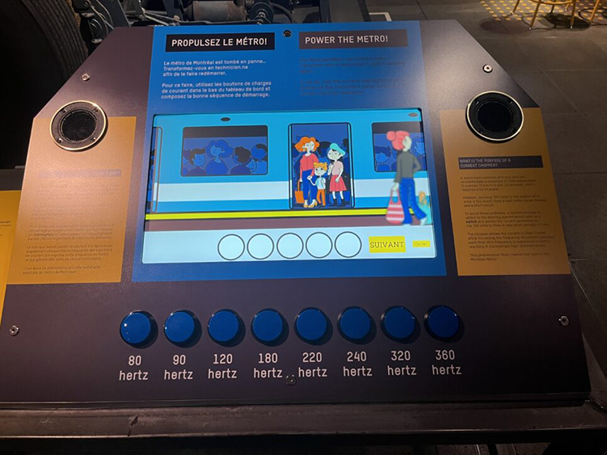

# Compte-rendu sur la conférence du Musée de l'ingéniosité par Martin Boucher
## Découverte des dispositifs multimédia du musée et des processus de mise en oeuvre

 

Le 23 mai dernier, nous avons reçu la visite par Teams de Martin Boucher, Technicien multimédia au Musée de l'ingéniosité J.Armand-Bombardier. Martin est intéressé par la technologie et l'Audio-visuel depuis fort longtemps. Ayant travaillé chez Stingray, Télé-Québec et dans des postes en événementiel, il fait maintenant parti de l'équipe multimédia du musée. Étant 3 dans l'équipe, ils ont tous leurs facilités et leurs types de projets favoris. Dans le cas de Martin, il est très intéressé par l'audio. 

Au musée, de nombreuses installations et événements nécéssitant un technicien en multimédia sur le plancher. Avec les expositions temporaires, l'exposition permanente, les spectacles, ateliers, simulateurs et bien plus, il y a toujours du travail pour Martin et ses collègues. Avec les technologies qui évoluent, les techniciens doivent rester à l'affût des nouveautés et des changements tout en travaillant sur des projets. 

Une exposition parlant du garage et de l'histoire du fondateur fût présenté durant la conférence. Martin a travaillé sur un projet linéaire pour raconter une histoire à travers des iamges, des objets, un univers, dans ce cas un garage et un magasin général. Il a particioé à la création de supports visuels à afficher sur des surfaces avec des projecteurs. L'éclairage a aussi été pensé autour de la pièce pour créer une atmosphère immersive autour des éléments de la pièce.

Un autre projet sur lequel Martin a travaillé est un dispositif multimédia ludique sur le Metro de Montréal. Dans une section d'une exposition, une pièce de Metro est présenté comme objet central, mais n'attire pas vraiment l'attention. C'est pourquoi que Martin a travaillé sur un projet de dispositif multimédia en lien direct avec cette pièce pour que les visiteurs prennent le temps d'en apprendre plus sur le Metro. Un jeu a été créé pour inciter les visiteurs, grand comme petit, à apprendre de nouvelles choses.

 

> Image du dispositif multimédia installé devant la pièce de Metro. Photo prise par Sylvie François, professeure de Muséologie.

 

Je trouve que le travail que Martin fait est inspirant. Il doit apprendre toutes sortes de choses pour mettre en oeuvre ses idées. Il utilise tout plein de technologies et logiciels différents pour créer des projets de toute sorte. Tout en pensant à l'accessibilité, au budget du musée et à l'expérience utilisateur, il sait faire gros avec ce qui est accessible.
