# Documentation du dispositif: Arbre en Face

> affiche de l'exposition des finissants TIM: ***Réseau Vivant***, exposé au grand Studio de la technique au collège Montmorency. Image provenant d'une publication dans l'équipe Teams de la technique TIM.

 

## Introduction
Le mardi 24 février ainsi que le mardi 17 mars, j'ai visité l'exposition des projets finaux des étudiants en Technique d'intégration Multimédia du collège. Cette exposition temporaire a été mise en place dans le grand studio de la technique et a ouvert ses portes le 16 mars, puis s'est terminé le 20 mars. La visite du 24 février, durant le trou à l'horaire, consistait à observer et à interagir pour la première fois avec les 6 projets finaux, non terminés en cette date. La visite était réservée aux étudiants du cours *d'oeuvres et dispositifs multimédia en exposition* pour notre travail de documentation. Ensuite, la visite du 17 mars, durant le trou à l'horaire, fût le moment où l'on pouvais découvrir les projets dans leur stade final, prêt au vernissage le soir même. Dans les 6 projets finaux des étudiants de troisième année, j'ai choisit de documenter le dispositif ***Arbre en Face***, que l'on pouvait observer dès notre entrée dans le studio.

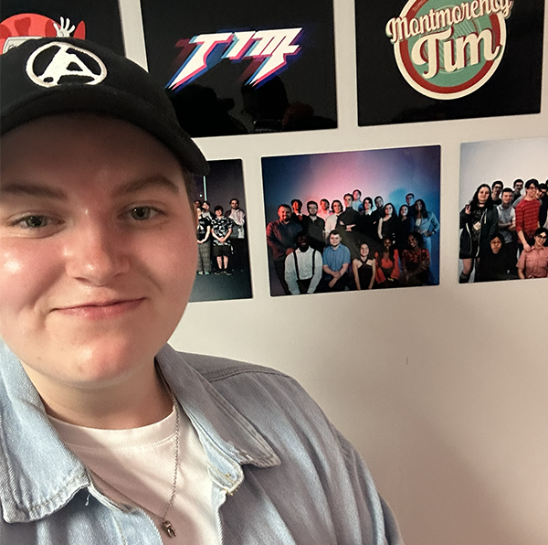
> Moi devant l'entrée du grand studio, où se situait l'exposition.

 

## Arbre en Face

> Logo du dispositif ***Arbre en Face***. Image provenant de la page d'accueil du site web du projet ***Arbre en Face***.

 

***Arbre en Face*** est un dispositif multimédia interactif créé par **Alexandre Gendron, Mikael Arseneau, Mathieu Willett, Matis Ghariani et Rafael Angon Dubé**. Ce projet rejoint la nature et l'humain dans une expérience immersive. En interagissant avec la toile sur laquelle est projetée une plaine, il est possible de faire apparaître tout un tas de surprises, comme des arbres, qui sont ornés de fleurs à l'allure plutôt humaine.

 

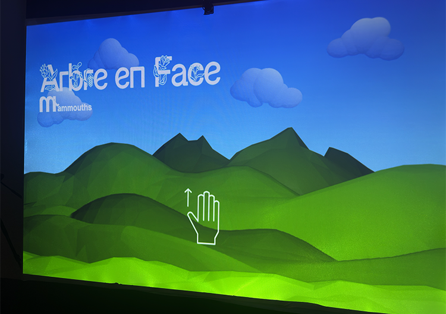
> Vue globale du dispositif ***Arbre en Face***

 

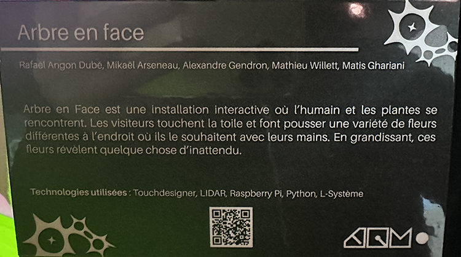
> texte de présentation du dispositif ***Arbre en Face***

 

## Mise en exposition

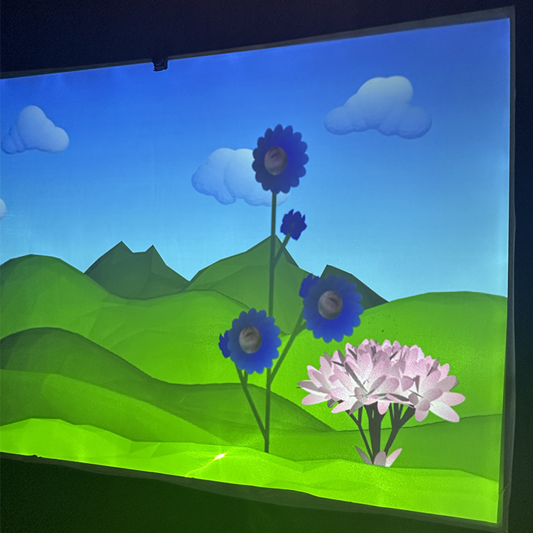 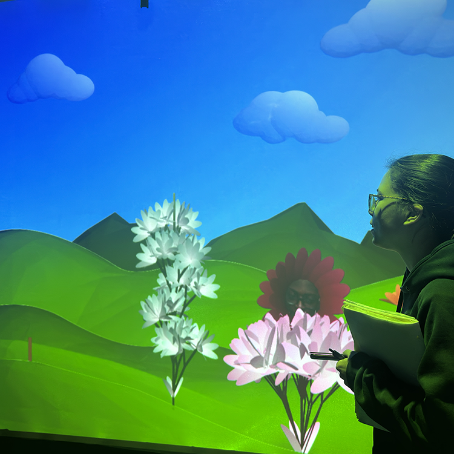
> Vue des arbres du dispositif ***Arbre en Face***

 

L'installation de cette oeuvre est à but contemplatif et interactif. Avec sa toile mesurant trois mètres de longueur et 2 mètres de hauteur, il est possible d'Avoir une bonne vue sur le dispositif d'un peu partout dans la salle d'exposition. Exposé dans le noir, ce dispositif est éclairé seulement par la lumière que projette le projecteur à l'arrière de la toile. Ce dit projecteur est caché à l'arrière de la toile, avec le reste du matériel, excepté l'un des ordinateurs qui fait fonctionner le tout. Il est possible d'interragir avec le dispositif en touchant des éléments sur la toile, comme des nuages, ou bien en glissant notre doigts de haut en bas pour faire croître des arbres. Au sommet des arbres, nous pouvons retrouver les visages de certains visiteurs qui ont été pris en photo durant la visite. 

 

Pour en savoir plus, voici la vidéo démonstration de leur projet: <https://www.youtube.com/watch?v=Qbv81vm1Bek>

 

## Mise en espace

Le dispositif ***Arbre en Face*** se trouve à l'entrée de l'exposition. En rentrant dans le grand studio, nous sommes accueillit par un objectif de caméra qui prend en photo notre visage. Celle-ci est installé sur le côté de l'installation. Ces photos se retrouvent ensuite sur le haut des arbres, dans un cadre fleur. L'équipe d'***Arbre en Face*** a collaboré avec l'équipe du dispositif ***Quand les yeux se croisent***, qui ont eux aussi des caméras prennant en photo le visage des visiteurs, pour se partager entre eux leur base de données d'images de visages. En marchant quelques pas de plus, nous pouvons appercevoir de face la toile du dispositif. le cadre de la toile est composé de poutre de bois. La toile est ensuite accroché au cadre avec des pinces en plastique imprimés en 3D à cet effet. Le bois a été traité avec du vernis et de la peinture pour embelir le tout. Au dessus de la toile est installé un capteur LIDAR pour calculer les mouvements et actions des doigts sur la toile. À la gauche du dispositif se retrouve un ordinateur avec moniteur où il est possible pour les créateurs du projet de s'occuper de celui-ci en cas de problèmes. 

À l'arrière de la toile, caché de tous, se trouve le projecteur au sol, la caméra ainsi que son trépied, l'ordinateur Raspberry Pi, un transmetteur et un récepteur Cat6, ainsi qu'une multitude de câbles et de connecteurs notés ci-bas. Pour les effets sonores faisant parti du projet, deux haut-parleurs sont installés, eux aussi, à l'arrière de la toile sur des pieds à cet effet. Le projecteur diffuse un fond de plaine en continu, puis des informations en plus, comme des événements et la croissance d'arbres, vont faire leur apparition seulement avec l'interactivité des visiteurs. Lors de l'apparition d'éléments, des effets sonores peuvent être entendus. Lorsqu'un arbre a poussé, celui-ci reste pendant un cours moment puis disparait pour laisser sa place à un autre arbre et à un nouveau visage.

 

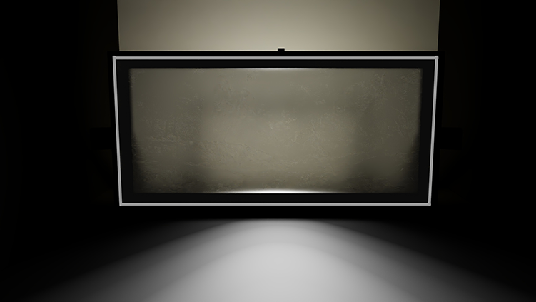 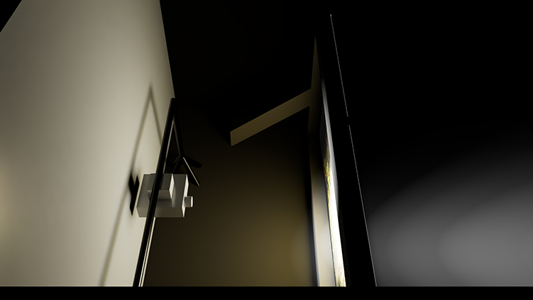 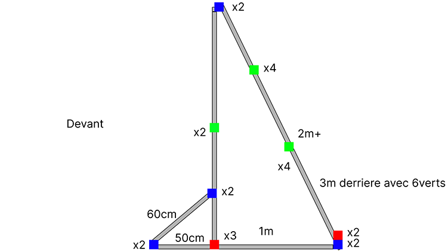 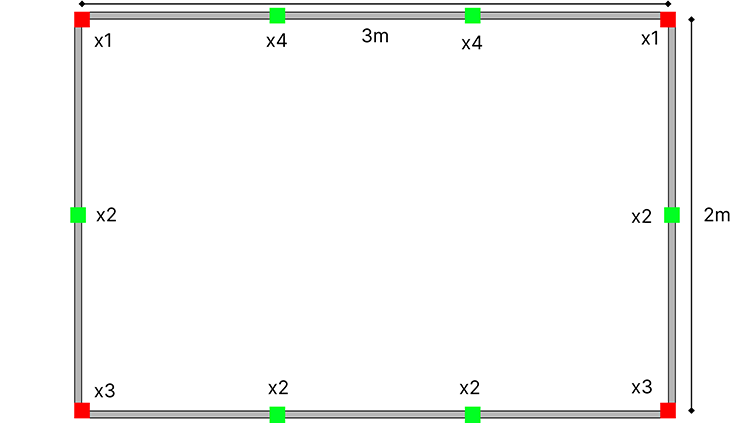
> Croquis du dispositif. Images provenant du site web du projet.

 

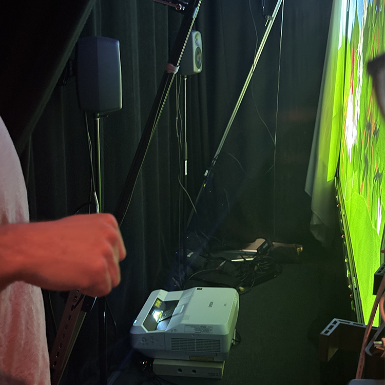 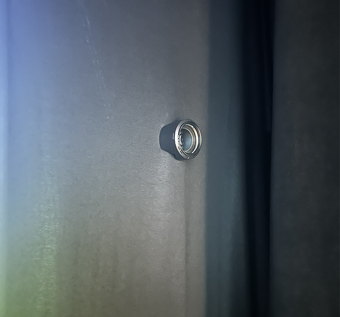 
>Image de l'arrière du dispositif ***Arbre en Face*** et de la caméra

 

 
## Composants techniques
Voici les composants de l'installation apercevables lors de ma visite:

 

**Strucuture:**
- Un cadre en bois de 2x3 mètres.
- Pattes en bois à l'arrière du cadre qui permettent de faire tenir le cadre.
- 40 pinces imprimés en 3D pour faire tenir la toile sur le cadre de bois.

 

**Interactivité:**
- Toile en splandex installé sur le cadre de bois.

 

La structure du dispositif ne peut pas être désassemblé. Lors d'un possible transport, il serait préférable de bien protéger la structure et le matériel fragile.

 

## Éléments nécessaires à la mise en exposition
La technique TIM a mis en place ces éléments pour l'exposition du dispositif: 

 

**Strucuture:**
- de multiples sacs de sable pour stabiliser la structure de bois et les éléments sur pieds ou trépieds.

 

**texte de présentation:**
- Une petite lumière del légèrement chaude qui éclaire seulement le texte de présentation installé sur un pied.

 

**Composants techniques:**
- Ordinateur (tour)
- Moniteur pour l'ordinateur
- Clavier et souris pour l'ordinateur
- 2 haut-parleurs sur leurs pieds
- Capteur LIDAR
- Projecteur
- Caméra et trépied
- BC204
- Transmetteur Cat6
- Récepteur Cat6

 

**Câbles:**
- 4 multiprise électrique
- 6 rallonge électrique
- 6 câbles ethernet
- 5 câbles HDMI
- 3 câbles XLR
- 4 câbles USB
- 2 câbles Display Port

 

Il est possible que d'autres éléments ont été fournis par la technique.
> Liste d'équipement de l'équipe sur la page web technique du projet: <https://mammouths.github.io/projet/#/technique/>

 

## Expérience vécue

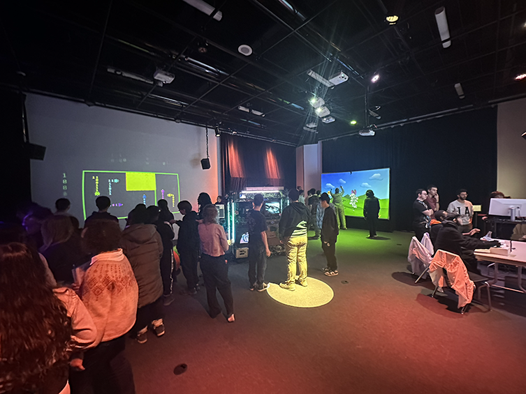
> Vue d'ensemble du grand studio.

 

### Posture du visiteur
L'exposition a une seule entrée, soit l'entrée du grand studio. Comme inscrit plus haut, ***Arbre en Face*** est visible dès l'entrée et fait face au centre du studio. L'exposition n'a pas d'ordre précis pour découvrir les dispositifs, donc les visiteurs peuvent se déplacer librement entre les projets. Un certain espace vide est présent devant la toile pour permettre l'interaction avec celle-ci et le déplacement. 

 

### Mon opinion sur le dispositif
J'ai bien aimé ce dispositif dès la première visite car son caractères loufoque et ses technologies plutôt impressionnantes et bien maîtrisées forment un bel ensemble. En visitant les projets des finnissants en TIM, je ne m'attendais pas à un projet avec une interactivité du genre. Lorsque je vois des installations de ce type en musée ou en vidéo, je trouve que maîtriser le mouvement sur une surface qui n'est pas un écrans semble complexe. C'est pour cela que je crois avoir accroché à se projet, je fût tout simplemente surprise par les technologies utilisées. Aussi, je trouve que leurs animations, effets visuels et "assets" 3D sont bien construit et animé.

Comme J'ai dit plus haut, j'aime beaucoup les technologies utilisées dans ce projet. L'utilisation d'un LIDAR pour calculer la position des mains sur la toile m'a possiblement inspiré pour de futurs projets. Je suis contente de savoir que du matériel du genre est disponnible à l'école et que l'équipe n'a pas eu besoin d'acheté des composants techniques de ce genre.

L'un des aspects que j'ai moins aimé dans le dispositif fût la déception que j'ai ressentie lorsque j'ai visité l'exposition la deuxième fois le 17 mars pour voir le résultat final du projet. Sur le site web du projet, les membres de l'équipe d'***Arbre en Face*** avaient partagés quelques idées d'animations et d'événements supplémentaires à rajouter à leur projet. Au final, peut de ces idées ont vu le jour. De nouveaux arbres ont vu le jour, mais la fonctionnalité d'arroser les plantes, par exemple, n'est pas arrivé dans la version finale du dispositif. C'est dommage mais je comprends bien l'enjeu de temps que les équipes ont pour travailler sur leurs projets.

 

## Références

J'ai (Florence Emond) photographié toutes les images de l'exposition et dessiné tous les croquis présents dans cette fiche, à moins spécifié autrement dans la légende de l'image. 

 

J'ai utilisé les ressources ci-jointes pour enrichir ma documentation: 

Site web de l'exposition des finissants: <https://tim-montmorency.com/2026/#/>
 
Site web du dispositif Arbre en Face: <https://expositions.musee-mccord-stewart.ca/fr/choix-expositions/voix-autochtones/ᐁᐧᐊᒄ-ᐁᔨᐦᑎᔮᐦᒡ-voila-ce-que-nous-sommes/>

Vidéo de démonstration du projet: <https://www.youtube.com/watch?v=Qbv81vm1Bek>
