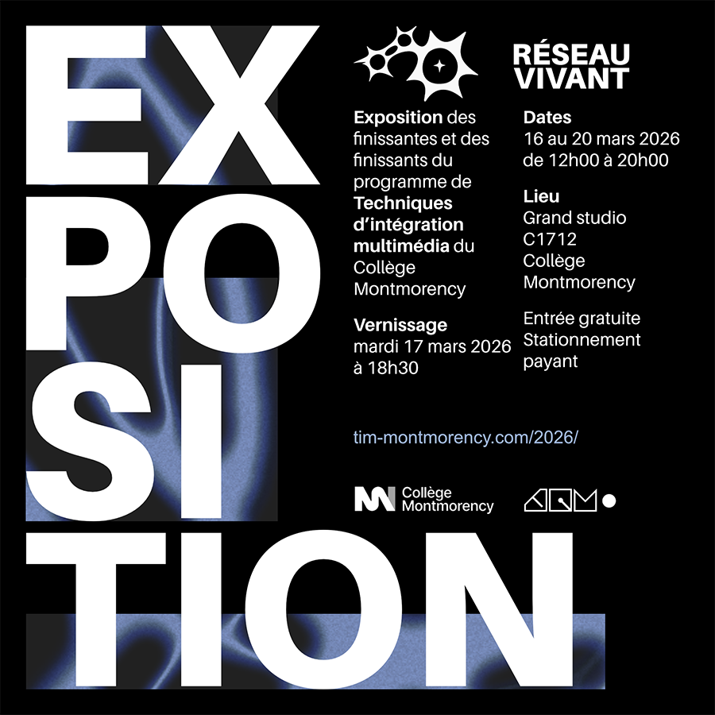

# Documentation du dispositif: Arbre en Face

> affiche de l'exposition des finissants TIM: ***Réseau Vivant***, exposé au grand Studio de la technique au collège Montmorency. Image provenant d'une publication dans l'équipe Teams de la technique TIM.

 

## Introduction
Le mardi 24 février ainsi que le mardi 17 mars, j'ai visité l'exposition des projets finaux des étudiants en Technique d'intégration Multimédia du collège. Cette exposition temporaire a été mise en place dans le grand studio de la technique et a ouvert ses portes le 16 mars, puis s'est terminé le 20 mars. La visite du 24 février, durant le trou à l'horaire, consistait à observer et à interagir pour la première fois avec les 6 projets finaux, non terminés en cette date. La visite était réservée aux étudiants du cours *d'oeuvres et dispositifs multimédia en exposition* pour notre travail de documentation. Ensuite, la visite du 17 mars, durant le trou à l'horaire, fût le moment où l'on pouvais découvrir les projets dans leur stade final, prêt au vernissage le soir même. Dans les 6 projets finaux des étudiants de troisième année, j'ai choisit de documenter le dispositif ***Arbre en Face***, que l'on pouvait observer dès notre entrée dans le studio.

> Moi devant l'entrée du grand studio, où se situait l'exposition.

 

## Arbre en Face

> Logo du dispositif ***Arbre en Face***

 

***Arbre en Face*** est un dispositif multimédia interactif créé par **Alexandre Gendron, Mikael Arseneau, Mathieu Willett, Matis Ghariani et Rafael Angon Dubé**. Ce projet rejoint la nature et l'humain dans une expérience immersive. En interagissant avec la toile sur laquelle est projetée une plaine, il est possible de faire apparaître tout un tas de surprises, comme des arbres, qui sont ornés de fleurs à l'allure plutôt humaine.

 

> Vue globale du dispositif ***Arbre en Face***

 

> texte de présentation du dispositif ***Arbre en Face***

 

## Mise en exposition

> Vue d'ensemble du dispositif ***Arbre en Face***

 

L'installation de cette oeuvre est à but contemplatif et interactif. Avec sa toile mesurant trois mètres de longueur et 2 mètres de hauteur, il est possible d'Avoir une bonne vue sur le dispositif d'un peu partout dans la salle d'exposition. Exposé dans le noir, ce dispositif est éclairé seulement par la lumière que projette le projecteur à l'arrière de la toile. Ce dit projecteur est caché à l'arrière de la toile, avec le reste du matériel, excepté l'un des ordinateurs qui fait fonctionner le tout. Il est possible d'interragir avec le dispositif en touchant des éléments sur la toile, comme des nuages, ou bien en glissant notre doigts de haut en bas pour faire croître des arbres. Au sommet des arbres, nous pouvons retrouver les visages de certains visiteurs qui ont été pris en photo durant la visite. 

 

## Mise en espace

Ces photos se retrouvent ensuite sur le haut des arbres, dans un cadre fleur. L'équipe d'***Arbre en Face*** a collaboré avec l'équipe du dispositif ***Quand les yeux se croisent***, qui ont eux aussi des caméras prennant en photo le visage des visiteurs, pour se partager entre eux leur base de données d'images de visages.

Le dispositif ***Arbre en Face*** se trouve à l'entrée de l'exposition. En rentrant dans le grand studio, nous sommes accueillit par un objectif de caméra qui prend en photo notre visage. Celle-ci est installé sur le côté de l'installation. En marchant quelques pas de plus, nous pouvons appercevoir de face la toile du dispositif. le cadre de la toile est composé de poutre de bois. La toile est ensuite accroché au cadre avec des pinces en plastique imprimés en 3D à cet effet. Le bois a été traité avec du vernis et de la peinture pour embelir le tout. Au dessus de la toile est installé un capteur LIDAR pour calculer les mouvements et actions des doigts sur la toile. À la gauche du dispositif se retrouve un ordinateur avec moniteur où il est possible pour les créateurs du projet de s'occuper de celui-ci en cas de problèmes. À l'arrière de la toile, caché de tous, se trouve le projecteur au sol, la caméra ainsi que son trépied, l'ordinateur Raspberry Pi, un transmetteur et un récepteur Cat6, ainsi qu'une multitude de câbles et de connecteurs notés ci-bas. Pour les effets sonores faisant parti du projet, deux haut-parleurs sont installés, eux aussi, à l'arrière de la toile sur des pieds à cet effet. Le projecteur diffuse un fond de plaine en continu, puis des informations en plus, comme des événements et la croissance d'arbres, vont faire leur apparition seulement avec l'interactivité des visiteurs. Lors de l'apparition d'éléments, des effets sonores peuvent être entendus. Lorsqu'un arbre a poussé, celui-ci reste pendant un cours moment puis disparait pour laisser sa place à un autre arbre et à un nouveau visage

 

 
>Image de l'arrière du dispositif ***Arbre en Face***

 

 
## Composants techniques
Voici les composants de l'installation apercevables lors de ma visite:

 

**Strucuture:**
- Trois poutres de métal incurvées.
- Bras de métal qui permettent de soutenir l'installation.

 

**Interactivité:**
- 14 écrans qui permettent la présentation des vidéos.
- Six hauts-parleurs sous forme de téléphones qui permettent l'écoute des vidéos.

 

**Câbles:**
- Minimum de 14 câbles hdmi.
- Minimum de 14 câbles d'alimentation pour les écrans.
- Câbles audios qui connectent les téléphones aux écrans.
- Câbles qui relient l'oeuvre à un ordinateur qui fait fonctionner le tout.
- Tout autres câbles en tout genre.

 

La structure de l'installation est plutôt complexe et ne semble pas se désassembler facilement. Lors d'un possible transport, il serait préférable de bien protéger la structure, le matériel et les écrans car tout cela est assez fragile.

 

## Éléments nécessaires à la mise en exposition
Le musée a utilisé ce matériel pour la mise en place de cette oeuvre: 

 

**Cartel/texte de présentation:**
- Une lumière légèrement chaude qui éclaire seulement le texte de présentation.

 

**Strucuture:**
- Un câble de métal qui soutient le poids de l'installation à partir du plafond.
- Les poutres qui permettent de soutenir le matériel au plafond.

 

**Autre:**
- Câbles en tout genre.
- Du matériel pour attacher et ranger correctement les câbles.

 

Il est possible que d'autres éléments soient fournis par le musée.

 

## Expérience vécue

> Vue d'ensemble de la pièce où se trouve l'oeuvre. Image provenant de la page web de l'Exposition.

 

### Posture du visiteur
L'entrée principale de l'exposition se trouve à la première partie de celle-ci. Un certain ordre chronologique est mis en place puisque l'exposition est divisée en quatre parties. Naturellement, les visiteurs vont découvrir l'exposition de la première à la quatrième partie. Toutefois, il n'est pas défendu de rentrer dans l'exposition par sa sortie à la quatrième partie. Rentrer de ce côté permet de voir l'oeuvre ***Mawlukhotine - Travaillons tous ensemble*** en premier donc il est possible que cette oeuvre soit l'introduction à l'exposition pour certains. 

Si on explore l'exposition dans l'ordre suggéré, la première partie est composé de plusieurs projections murale directement à l'entrée. La deuxième partie est un assemblage de textes, de vidéos, de photographies et d'objets en exposition éparpillés dans une même pièce. La troisième partie est semblabe à la partie précédente, mais intègre aussi de la projection murale et se retrouve dans une pièce à l'atmosphère et à l'éclairage plus sombre. Finalement, la quatrième partie est une conclusion aux autres parties, sous forme de vidéos et d'objets en exposition.

 

### Mon opinion sur l'oeuvre
J'ai apprécié le contenu présenté à travers cette oeuvre. Il est possible, à travers les 14 vidéos, de découvrir 14 projets extrêmement pertinents et bénéfiques à la communauté autochtone et allochtone du Québec. Ne faisant pas partie de ces communautés, je ne suis pas beaucoup sensibilisé aux moyens que prennent les premières nations pour préserver leur patrimoine, éduquer les prochaines génération et mettre en valeur leur droits. Je trouve que cette oeuvre est un parfait moyen de sensibiliser des personnes dans la même situation que moi, puis de mettre sous le feu des projecteurs des organismes et projets valorisants qui ont droit à beaucoup plus de visibilité.

Comme J'ai dit plus haut, j'aime que cette installation peut sensibiliser la population sous différents aspects. Grâce à une oeuvre de ce genre, je suis persuadé qu'au moins une personne s'est demandé: "Comment puis-je aider ma communauté et les communautés qui m'entourent?". J'espère que certaines personnes ont décidé de prendre action et de s'investir dans un OBNL, de faire des dons ou bien de partager avec leur proches les ressources présentées dans cette oeuvre qui mérite d'être mise de l'avant. 

L'un des aspects que j'ai moins aimé dans l'oeuvre est la qualité de production de certaines des vidéos présentées. Certaines vidéos sont sous forme de documentaire, avec des images, des vidéos et de l'audio de bonne qualité, tandis que d'autres sont majoritairement composé de vidéos prises à la webcam avec une qualité sonore beaucoup plus basse. Je trouve que la qualité de certaines vidéos auraient pu être amélioré avec l'utilisation d'un micro de meilleure qualité. Aussi, certaines vidéos ont des coupures de montage qui pourraient être améliorés au niveaux de l'audio. malgré tout, ces points ne gâchent pas l'expérience générale qu'offre l'oeuvre.

 

## Références

J'ai (Florence Emond) photographié toutes les images de l'exposition et dessiné tous les croquis présents dans cette fiche, à moins spécifié autrement dans la légende de l'image. 

 

J'ai utilisé les ressources ci-jointes pour enrichir ma documentation: 

Site web de l'exposition des finissants: <https://tim-montmorency.com/2026/#/>
 
Site web du dispositif Arbre en Face: <https://expositions.musee-mccord-stewart.ca/fr/choix-expositions/voix-autochtones/ᐁᐧᐊᒄ-ᐁᔨᐦᑎᔮᐦᒡ-voila-ce-que-nous-sommes/>

Vidéo de démonstration du projet: <https://www.youtube.com/watch?v=Qbv81vm1Bek>
