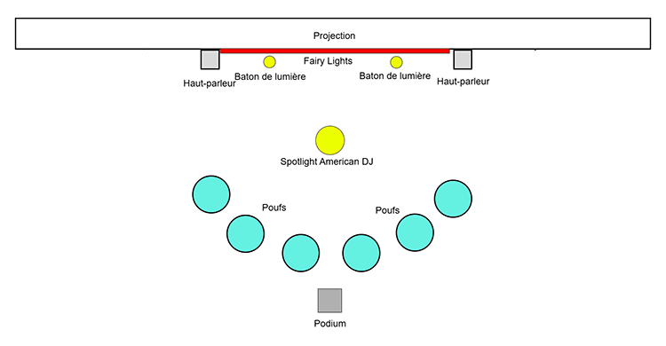
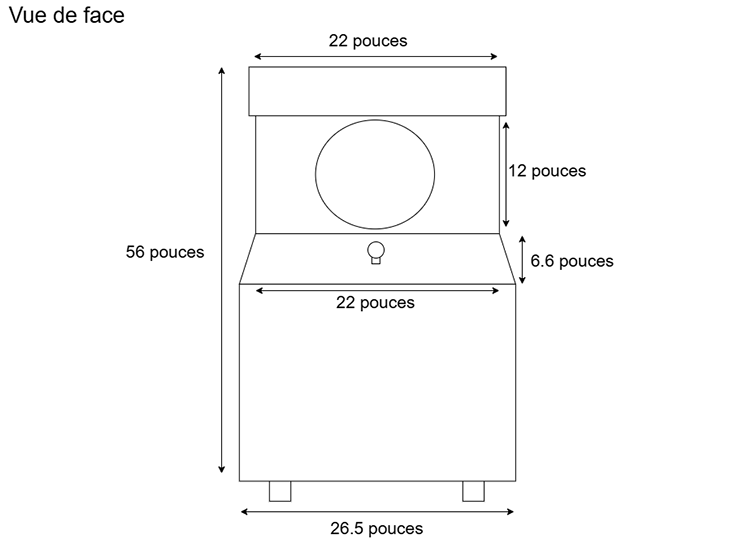
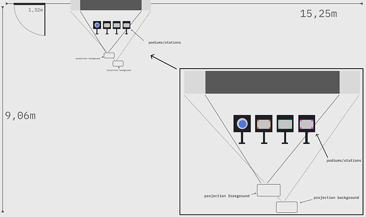
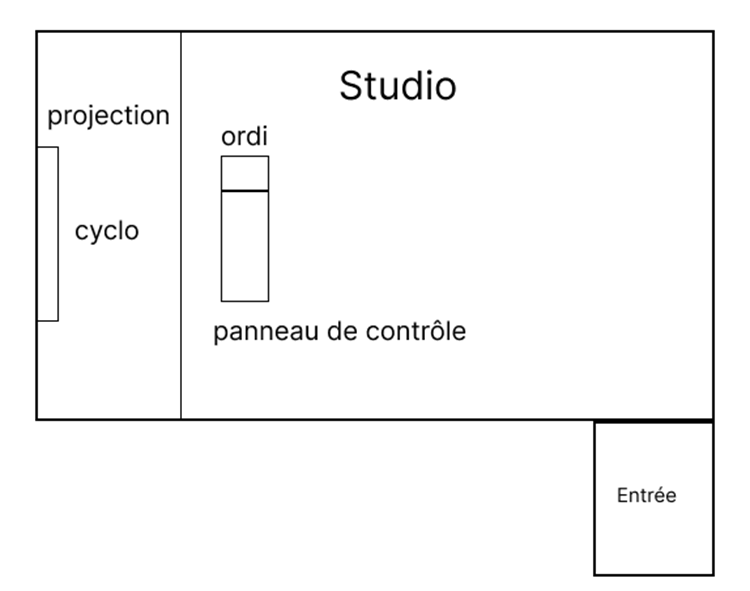
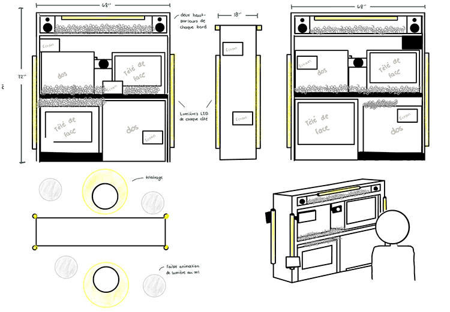

# Palmarès des projets de l'exposition Réseau Vivant

## 1. Arbre en Face
> **Par Alexandre Gendron, Mikael Arseneau, Mathieu Willett, Matis Ghariani et Rafael Angon Dubé**

 

[Voir la fiche de l'installation pour plus de détails ](https://github.com/FloFlowe/H26_V11_inspirations_EMOND/blob/main/Expositions/tim_studio_reseau_vivant/fiche_reseau_vivant_arbre_en_face.md)

 

## 2. Terminal
> **Par Émeryk Bélisle, Elie Daher, Ting Yung Lu Terry, Dana Saavedra-Torrano et Mégane Ranger**

 

**Installation en cours (ou finale) et Schéma de mise en espace**

 

 

**Mon ressenti** 
Avant d'essayer l'installation, je trouvais que le projet avait une belle identité et fluidité artistique. Dès le premier coup d'oeil, ce projet met en place une belle atmosphère de jeu avec les poufs en demi  cercle et les effets lumineux vert au mur. En essayent le jeu, je trouve que celui-ci a le potentiel d'être très amusant à jouer à plusieur. Avec de nombreux niveaux à disposition et des fonctionalités qui sont encore à découvrir, je trouve que ce projet a un bon futur et a de très bonnes fondations pour un projet final. L'un des membres de l'équipe, Émeryk Bélisle, m'a parlé de son projet avec passion, on voit qu'il y met du temps pour le perfectionner.

 

## 3. Océan Rouge
> **Par Amira Tounekti et Kristy Moussally**

 

**Installation en cours (ou finale) et Schéma de mise en espace**

 

 

**Mon ressenti**
À première vue, ce projet ne semblait pas être quelque chose de très poussé. À la première visite, La borne d'Arcade était installé à l'extérieur du studio et je pensais qu'il y avait donc que 5 projets de finissants. Après avoirjoué à leur borne et après avoir compris que seulement 2 personnes avaient rapidement mis en place ce projet, j'ai eu un bon ressenti de ce projet. Leur jeu permet de commencer au point A, puis de ce donner le défis de le continuer jusqu'à la fin, au point B. Leur jeu a donc un aspect addictif qui donner envie de continuer à jouer. Je trouve que leur projet a un beau message, qui est de protéger l'environnement en nettoyant les océans.

 

## 4. Symbiose
> **Par Yannick Chamberland, Benjamin Ferland, Ryan Dufault et Walid Cheour**

 

**Installation en cours (ou finale) et Schéma de mise en espace**

 

 

**Mon ressenti**
En regardant rapidement cette installation, la première chose que j'ai remarqué fut la modélisation 3D de l'interface interactive. Je trouve que certains des éléments sont très bien fabriqués, tandis que d'autres l'étaient moins. Je trouve qu'il manquait une certaine cohésion mais rien de majeur. En regardant certaines personnes jouer, j'ai beaucoup apprécié les technologies utilisées dans le projet car l'interactivité entre les boutons, les objets et la confection de potions semblait amusant, tout en étant complexe. DAns l'installation finale, j'ai beaucoup aimé les podiums qui soutenaient les éléments de jeu, les précédents étaient moins bien fabriqués.

 

## 5. Mission Décollage
> **Par Ahmed Kaissoumi, Radhouane Kordan, Justin Montpetit, Thearylou Lach et Jad Saloumi**

 

**Installation en cours (ou finale) et Schéma de mise en espace**

 

 

**Mon ressenti**
Ce projet prend beaucoup de place dans le studio donc il n'est pas facile à manquer. Lorsque j'ai vue le jeu en action pour la première fois, je trouvais que la cohésion entre certains éléments du jeu n'étaient pas optimales. Tout de même, ce projet est complexe et l'équipe semble avoir bien travaillé dessus. L'installation finale tant qu'à elle était plus réeussie selon moi, donc voir le jeu plus complet en action fut une bonne surprise. Les fonctionnalités à l'intérieur fonctionnent bien et apporte à la collaboration entre joueurs.

 

## 6. Quand les yeux se croisent
> **Par Edelwyn Ledru, Félix Lavoie, Jade Hébert, Manel Yaya et Patricia Nassif**

 

**Installation en cours (ou finale) et Schéma de mise en espace**

 

 

**Mon ressenti**

 

