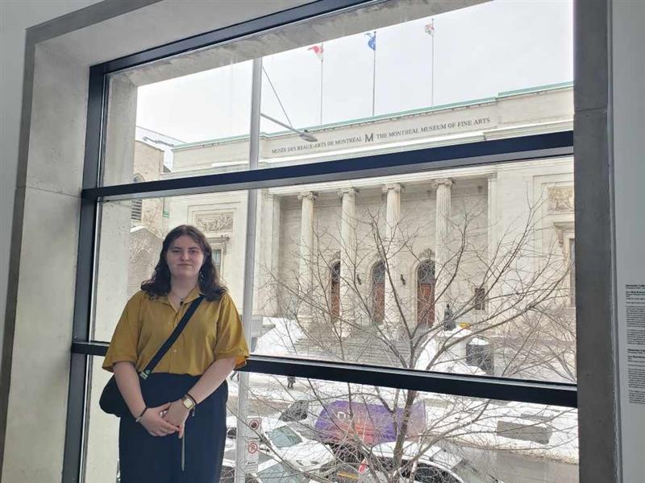

# Florence Emond

> Photo de moi au Musée des Beaux Arts de Montréal lors d'une visite pour voir des collections originales du MBAM.

## **Intérêts dans le multimedia**
J'aime bien la création numérique en tout genre. Que se soit le design ou la photographie, dès que la créativité fait partie d'un projet, je me retrouve intrigué par la chose. J'aime plutôt travailler sur des projets en solo mais un projet d'équipe apporte toutes sortes d'inspirations. Je trouve que la plupart des projets en multimédia sont enrichissants et j'aime donc en faire partie pour en apprendre davantage. J'aime beaucoup découvrir les oeuvres qui ont été créés à travers le temps. J'apprécie beaucoup découvrir l'histoire des oeuvres lorsque je vais au musée, ainsi que l'évolution des mouvements artistiques. D'ailleurs, lors de ma dernière visite au MBAM, j'ai beaucoup appris sur l'histoire de plusieurs nations au fil du temps à travers la Collection d'Art du Tout-Monde.

**L'exposition en question:**
<https://www.mbam.qc.ca/fr/arts-du-tout-monde/>
